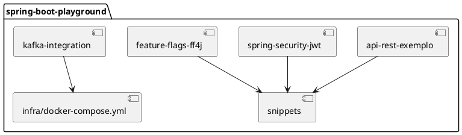

# 🧩 Spring Boot Playground

Este repositório é um **hub central de conteúdos**, projetos e **snippets úteis com Spring Boot**, voltado a desenvolvedores que desejam aprender, praticar e evoluir com o ecossistema Spring.

## 🚀 Visão Geral

Aqui você encontrará:

- Exemplos práticos de APIs REST com Spring Boot
- Integração com bancos de dados (JPA, Flyway, MongoDB, Redis, etc.)
- Segurança com Spring Security, JWT e OAuth2
- Testes unitários e de integração com JUnit e MockMvc
- Configuração de cache, filas Kafka, feature flags e muito mais
- Dicas e boas práticas de arquitetura com Spring

---

## 📁 Estrutura do Repositório

```bash
spring-boot-playground/
├── api-rest-exemplo/         # Projeto completo com CRUD, DTOs, validação e testes
├── spring-security-jwt/      # Exemplo de autenticação com JWT
├── kafka-integration/        # Integração com Apache Kafka
├── feature-flags-ff4j/       # Feature toggles usando FF4J
├── cache-com-redis/          # Cache com Redis configurado
├── snippets/                 # Trechos reutilizáveis prontos para copiar e colar
│   ├── RestController.java
│   ├── SwaggerConfig.java
│   ├── GlobalExceptionHandler.java
│   └── ...
└── README.md
```

---

## 📌 Destaques

| Tema                       | Descrição                                                                 |
|---------------------------|---------------------------------------------------------------------------|
| ✅ **REST API**           | Estrutura moderna com DTOs, JPA, validação e versionamento de endpoints   |
| 🔒 **Segurança**          | Spring Security com JWT, RBAC e CORS configurável                         |
| 📦 **Mensageria**         | Exemplos com Kafka e RabbitMQ                                             |
| 🧪 **Testes**             | JUnit 5, Mockito, Testcontainers e boas práticas de testes de integração  |
| ⚙️ **Feature Flags**      | Gerenciamento dinâmico de recursos com FF4J e @ConditionalOnProperty      |
| ⚡ **Performance**         | Configuração de cache com Redis e Caffeine                               |
| ☁️ **Cloud-ready**        | Deploys com Docker, Spring Profiles e Cloud Config                       |

---

## 📚 Para Quem É Este Repositório?

- Estudantes iniciando no Spring Boot
- Desenvolvedores Java buscando aprofundamento em microservices
- Engenheiros de software que desejam ter um repositório de referência para o dia a dia
- Arquitetos que buscam boas práticas e exemplos de arquitetura limpa

---

## 🧪 Requisitos e Execução

### Requisitos:
- Java 17+
- Maven ou Gradle
- Docker (para exemplos com banco de dados ou Kafka)

### Como rodar um projeto:

```bash
cd api-rest-exemplo
./mvnw spring-boot:run
```

ou

```bash
cd kafka-integration
docker-compose up -d
./mvnw spring-boot:run
```

---

## 🌱 Contribuindo

Contribuições são bem-vindas! Sinta-se livre para abrir **issues** ou enviar **pull requests** com melhorias, novos exemplos ou correções.

---

## 📜 Licença

Este projeto está licenciado sob a [MIT License](LICENSE).

---

## 📎 Referências Úteis

- [Documentação Oficial do Spring Boot](https://docs.spring.io/spring-boot/)
- [Baeldung - Tutoriais Spring](https://www.baeldung.com/)
- [Start Spring](https://start.spring.io/)
- [Spring Security Reference](https://docs.spring.io/spring-security/)

---

## ✨ Diagrama de Organização



---

Feito com 💛 por desenvolvedores que amam o ecossistema Spring.